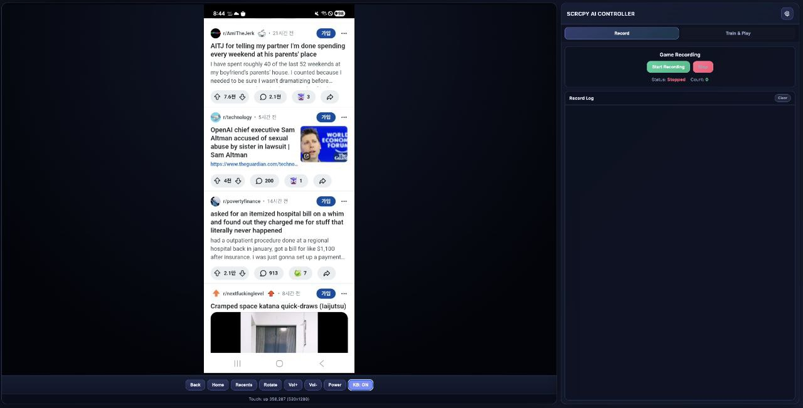

**This is a fork of [scrcpy](https://github.com/Genymobile/scrcpy) with AI agent
and web remote control features added.**

# scrcpy-ai (based on v3.3.4)


_scrcpy + AI Vision Agent + Web Remote Control_

This fork extends scrcpy with:

- **AI Vision Agent** — LLM analyzes Android screen and autonomously performs touch/key actions
- **Web Remote Control** — Real-time video streaming + remote touch control from a web browser
- **CLIP Matching** — Screen embedding-based similarity matching for game/app automation
- **Record/Train/Play** — Gesture sequence recording → training → automatic playback pipeline



---

## Fork Features

### AI Vision Agent

Uses OpenRouter API to let a VLM (Vision Language Model) see and control the Android screen.

- **Hybrid Decision Mode** — Memory DB (ChromaDB) lookup first, VLM fallback when no match
  - Perceptual hashing (pHash) for screen state detection
  - Semantic action matching with configurable similarity threshold
  - Penalty system to avoid repeating recent actions
- **Function Calling Tools** — `click`, `long_press`, `swipe`, `key_press`, `input_text`, `screenshot`
- **Decision Tree Automation** — Conditional branching for complex multi-step scenarios
- **CLIP Auto-Play** — ViT-B-32 visual embedding matching for pattern-based automation
- **Safety Guardrails** — Max same-screen repetitions, max repeated touches, runtime limit (default 120 min), iteration limit (50 per prompt)
- **Screenshot Processing** — Auto-downscale to max 1280px for consistent VLM coordinate mapping

**Supported Models (via OpenRouter):**
- LLM: `openai/gpt-4o-mini` (default)
- Vision: `google/gemini-2.5-flash-lite` (default)

### Web Remote Control

Run scrcpy on a headless server and control the device remotely from a web browser.

```
Browser (HTTPS) → Apache Reverse Proxy
  ├─ /ws/video, /ws/control → C backend (Mongoose, port 18080)
  └─ / (everything else)    → Python FastAPI (port 8080)
```

**Video Streaming:**
- H.264/H.265 real-time streaming via WebSocket (jmuxer.js → MSE browser HW decoding)
- Keyframe caching for instant playback on client connect
- SPS/PPS cache invalidation on codec config change (safe app switching)
- Backpressure handling — skips slow clients (>512KB send buffer) to prevent memory bloat
- Automatic jmuxer error recovery (reinitializes on buffer errors)

**Remote Input:**
- Touch events (down/move/up) via WebSocket
- Key shortcuts: Back, Home, App Switch, Volume Up/Down, Power
- Keycode injection with metastate support
- Text input

**Python Backend (FastAPI):**
- Session-based OTP authentication with 15-minute expiration
- Agent control API — start/stop autonomous agent, submit prompts
- Game rules configuration for autonomous mode
- Recording pipeline — capture frames + touch coordinates per session
- Training API — CLIP embedding generation, label management, decision tree editor
- Memory management — ChromaDB stats, action history, heuristics clearing
- WebSocket proxy to C backend

### C Backend API

The C backend (Mongoose HTTP/WebSocket server) exposes internal endpoints:

| Endpoint | Method | Description |
|----------|--------|-------------|
| `/internal/screenshot` | GET | Capture current frame as JPEG (with dimension headers) |
| `/internal/info` | GET | Get current screen/frame dimensions (JSON) |
| `/internal/click` | POST | Inject tap at coordinates (`x`, `y`, optional `w`, `h`) |
| `/internal/long_press` | POST | Long press (`x`, `y`, optional `duration_ms`) |
| `/internal/swipe` | POST | Swipe gesture (`x1`, `y1`, `x2`, `y2`, optional `duration_ms`) |
| `/internal/key` | POST | Inject Android keycode (`keycode`, optional `action`) |
| `/internal/text` | POST | Type text string (`text`) |
| `/ws/video` | WS | Video stream — initial JSON metadata, then binary NAL units |
| `/ws/control` | WS | Touch/key control — JSON messages |

### Record / Train / Play Pipeline

1. **Record** — Capture frames and touch coordinates during manual interaction
2. **Train** — Generate CLIP embeddings for recorded frames, label actions, build decision trees
3. **Play** — Load embeddings and let the CLIP matcher or decision tree automate playback

Session data is stored in `~/.scrcpy_ai/records/`.

---

## Quick Start

### Headless Web Remote Mode

```bash
# Start C backend with web route enabled
scrcpy --no-window --no-audio --webroute 18080 \
  --video-bit-rate=4M --video-codec-options=i-frame-interval=2 \
  --max-size=1280 -s <device-serial>

# Start Python FastAPI backend (in a separate terminal)
cd app/python
python -m scrcpy_ai.main --port 8080 --scrcpy-port 18080
```

### AI Agent Mode

```bash
# Configure via the web UI or API
curl -X POST http://localhost:8080/api/config \
  -H 'Content-Type: application/json' \
  -d '{"api_key": "your-openrouter-key", "model": "openai/gpt-4o-mini", "vision_model": "google/gemini-2.5-flash-lite"}'

# Start autonomous agent
curl -X POST http://localhost:8080/api/auto/start

# Or submit a one-shot prompt
curl -X POST http://localhost:8080/api/prompt \
  -H 'Content-Type: application/json' \
  -d '{"prompt": "Open Settings and turn on Wi-Fi"}'
```

---

## Fork CLI Options

| Option | Description |
|--------|-------------|
| `--webroute <port>` | Enable web route API server (video streaming + device control) |

## Additional Build Dependencies

| Library | Purpose |
|---------|---------|
| libswscale | Screenshot image scaling (required when `webroute=true`) |

Build with `webroute` enabled:

```bash
meson setup build -Dwebroute=true
ninja -C build
```

## Python Dependencies

| Package | Purpose |
|---------|---------|
| `fastapi` | Web framework for Python backend |
| `uvicorn` | ASGI server |
| `openai` | OpenRouter API client |
| `open-clip-torch` | CLIP visual embeddings |
| `chromadb` | Vector DB for action memory |
| `httpx` | HTTP client to C backend |
| `Pillow` | Image processing |
| `imagehash` | Perceptual hashing (pHash) |
| `pyotp` / `qrcode` | OTP authentication |

---

## Original scrcpy

This application mirrors Android devices (video and audio) connected via USB or
[TCP/IP](doc/connection.md#tcpip-wireless) and allows control using the
computer's keyboard and mouse. It does not require _root_ access or an app
installed on the device. It works on _Linux_, _Windows_, and _macOS_.


It focuses on:

 - **lightness**: native, displays only the device screen
 - **performance**: 30~120fps, depending on the device
 - **quality**: 1920×1080 or above
 - **low latency**: [35~70ms][lowlatency]
 - **low startup time**: ~1 second to display the first image
 - **non-intrusiveness**: nothing is left installed on the Android device
 - **user benefits**: no account, no ads, no internet required
 - **freedom**: free and open source software

[lowlatency]: https://github.com/Genymobile/scrcpy/pull/646

Its features include:
 - [audio forwarding](doc/audio.md) (Android 11+)
 - [recording](doc/recording.md)
 - [virtual display](doc/virtual_display.md)
 - mirroring with [Android device screen off](doc/device.md#turn-screen-off)
 - [copy-paste](doc/control.md#copy-paste) in both directions
 - [configurable quality](doc/video.md)
 - [camera mirroring](doc/camera.md) (Android 12+)
 - [mirroring as a webcam (V4L2)](doc/v4l2.md) (Linux-only)
 - physical [keyboard][hid-keyboard] and [mouse][hid-mouse] simulation (HID)
 - [gamepad](doc/gamepad.md) support
 - [OTG mode](doc/otg.md)
 - and more…

[hid-keyboard]: doc/keyboard.md#physical-keyboard-simulation
[hid-mouse]: doc/mouse.md#physical-mouse-simulation

## Prerequisites

The Android device requires at least API 21 (Android 5.0).

[Audio forwarding](doc/audio.md) is supported for API >= 30 (Android 11+).

Make sure you [enabled USB debugging][enable-adb] on your device(s).

[enable-adb]: https://developer.android.com/studio/debug/dev-options#enable

On some devices (especially Xiaomi), you might get the following error:

```
Injecting input events requires the caller (or the source of the instrumentation, if any) to have the INJECT_EVENTS permission.
```

In that case, you need to enable [an additional option][control] `USB debugging
(Security Settings)` (this is an item different from `USB debugging`) to control
it using a keyboard and mouse. Rebooting the device is necessary once this
option is set.

[control]: https://github.com/Genymobile/scrcpy/issues/70#issuecomment-373286323

Note that USB debugging is not required to run scrcpy in [OTG mode](doc/otg.md).


## Get the app

 - [Linux](doc/linux.md)
 - [Windows](doc/windows.md) (read [how to run](doc/windows.md#run))
 - [macOS](doc/macos.md)


## Must-know tips

 - [Reducing resolution](doc/video.md#size) may greatly improve performance
   (`scrcpy -m1024`)
 - [_Right-click_](doc/mouse.md#mouse-bindings) triggers `BACK`
 - [_Middle-click_](doc/mouse.md#mouse-bindings) triggers `HOME`
 - <kbd>Alt</kbd>+<kbd>f</kbd> toggles [fullscreen](doc/window.md#fullscreen)
 - There are many other [shortcuts](doc/shortcuts.md)


## Usage examples

There are a lot of options, [documented](#user-documentation) in separate pages.
Here are just some common examples.

 - Capture the screen in H.265 (better quality), limit the size to 1920, limit
   the frame rate to 60fps, disable audio, and control the device by simulating
   a physical keyboard:

    ```bash
    scrcpy --video-codec=h265 --max-size=1920 --max-fps=60 --no-audio --keyboard=uhid
    scrcpy --video-codec=h265 -m1920 --max-fps=60 --no-audio -K  # short version
    ```

 - Start VLC in a new virtual display (separate from the device display):

    ```bash
    scrcpy --new-display=1920x1080 --start-app=org.videolan.vlc
    ```

 - Record the device camera in H.265 at 1920x1080 (and microphone) to an MP4
   file:

    ```bash
    scrcpy --video-source=camera --video-codec=h265 --camera-size=1920x1080 --record=file.mp4
    ```

 - Capture the device front camera and expose it as a webcam on the computer (on
   Linux):

    ```bash
    scrcpy --video-source=camera --camera-size=1920x1080 --camera-facing=front --v4l2-sink=/dev/video2 --no-playback
    ```

 - Control the device without mirroring by simulating a physical keyboard and
   mouse (USB debugging not required):

    ```bash
    scrcpy --otg
    ```

 - Control the device using gamepad controllers plugged into the computer:

    ```bash
    scrcpy --gamepad=uhid
    scrcpy -G  # short version
    ```

## User documentation

The application provides a lot of features and configuration options. They are
documented in the following pages:

 - [Connection](doc/connection.md)
 - [Video](doc/video.md)
 - [Audio](doc/audio.md)
 - [Control](doc/control.md)
 - [Keyboard](doc/keyboard.md)
 - [Mouse](doc/mouse.md)
 - [Gamepad](doc/gamepad.md)
 - [Device](doc/device.md)
 - [Window](doc/window.md)
 - [Recording](doc/recording.md)
 - [Virtual display](doc/virtual_display.md)
 - [Tunnels](doc/tunnels.md)
 - [OTG](doc/otg.md)
 - [Camera](doc/camera.md)
 - [Video4Linux](doc/v4l2.md)
 - [Shortcuts](doc/shortcuts.md)


## Resources

 - [FAQ](FAQ.md)
 - [Translations][wiki] (not necessarily up to date)
 - [Build instructions](doc/build.md)
 - [Developers](doc/develop.md)

[wiki]: https://github.com/Genymobile/scrcpy/wiki


## Articles

- [Introducing scrcpy][article-intro]
- [Scrcpy now works wirelessly][article-tcpip]
- [Scrcpy 2.0, with audio][article-scrcpy2]

[article-intro]: https://blog.rom1v.com/2018/03/introducing-scrcpy/
[article-tcpip]: https://www.genymotion.com/blog/open-source-project-scrcpy-now-works-wirelessly/
[article-scrcpy2]: https://blog.rom1v.com/2023/03/scrcpy-2-0-with-audio/

## Contact

You can open an [issue] for bug reports, feature requests or general questions.

For bug reports, please read the [FAQ](FAQ.md) first, you might find a solution
to your problem immediately.

[issue]: https://github.com/Genymobile/scrcpy/issues

You can also use:

 - Reddit: [`r/scrcpy`](https://www.reddit.com/r/scrcpy)
 - BlueSky: [`@scrcpy.bsky.social`](https://bsky.app/profile/scrcpy.bsky.social)
 - Twitter: [`@scrcpy_app`](https://twitter.com/scrcpy_app)


## Donate

I'm [@rom1v](https://github.com/rom1v), the author and maintainer of _scrcpy_.

If you appreciate this application, you can [support my open source
work][donate]:
 - [GitHub Sponsors](https://github.com/sponsors/rom1v)
 - [Liberapay](https://liberapay.com/rom1v/)
 - [PayPal](https://paypal.me/rom2v)

[donate]: https://blog.rom1v.com/about/#support-my-open-source-work

## License

    Copyright (C) 2018 Genymobile
    Copyright (C) 2018-2026 Romain Vimont

    Licensed under the Apache License, Version 2.0 (the "License");
    you may not use this file except in compliance with the License.
    You may obtain a copy of the License at

        http://www.apache.org/licenses/LICENSE-2.0

    Unless required by applicable law or agreed to in writing, software
    distributed under the License is distributed on an "AS IS" BASIS,
    WITHOUT WARRANTIES OR CONDITIONS OF ANY KIND, either express or implied.
    See the License for the specific language governing permissions and
    limitations under the License.
